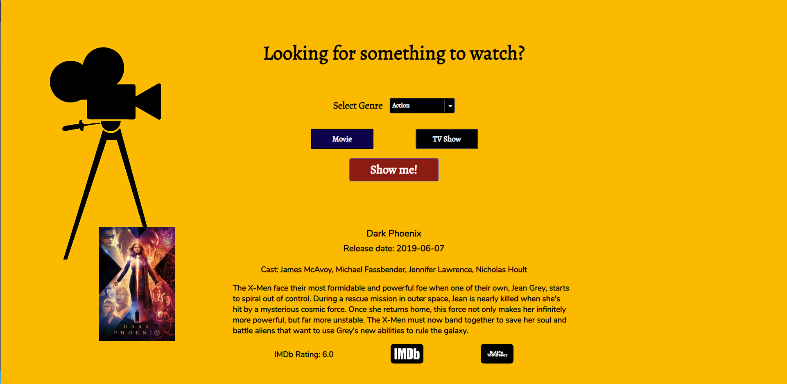

What to Watch

link to live app: https://skang28.github.io/What-to-watch/

Summary: This app is designed for individuals who are looking for something to watch, but just can't figure out what to watch. The user inputs what genre he/she is interested in, and selects either a movie or TV show. The app then outputs a randomly selected movie or TV show, and displays basic movie information including release date, cast, and plot overview. An IMDb rating as well as links to the movie/TV show's IMDb & RottenTomatoes page is available as well.

Technology used: HTML, CSS, Javascript, and JQuery.

